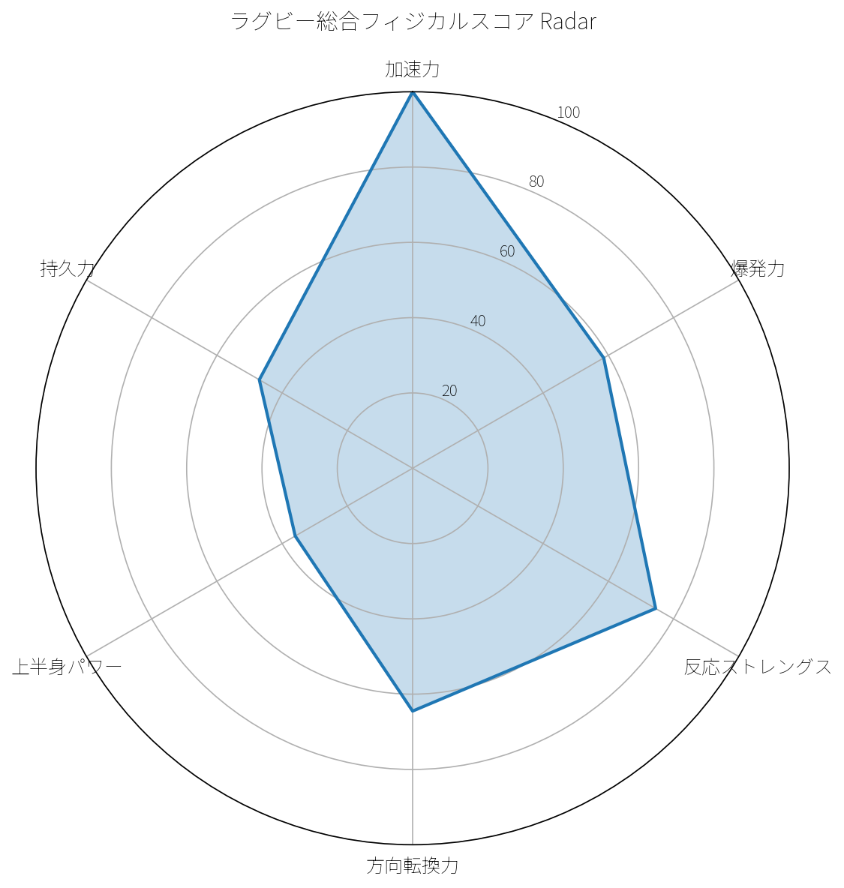
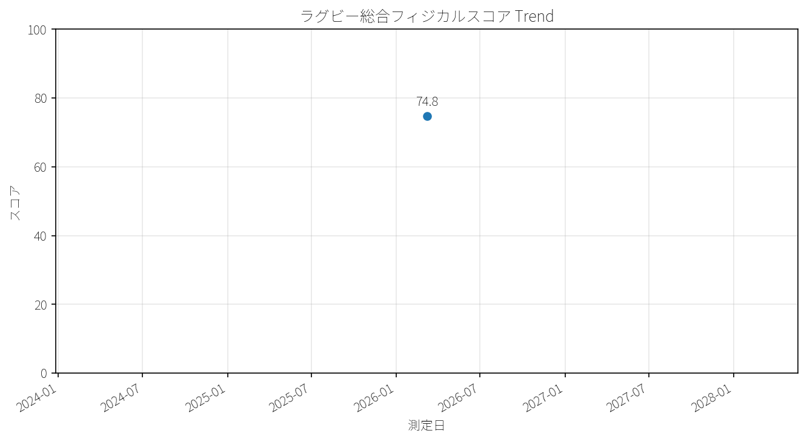
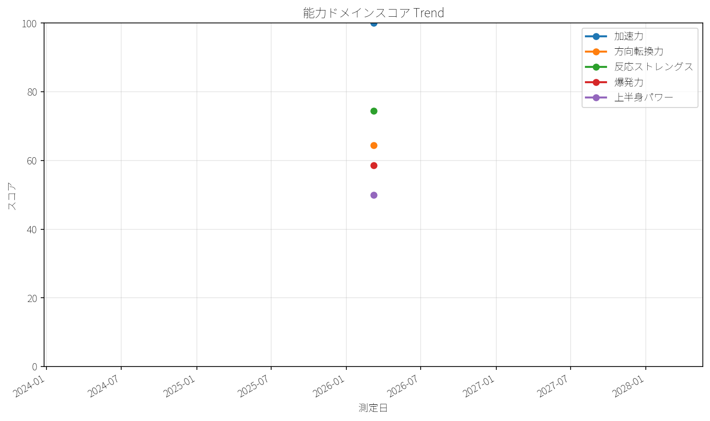

# 最新サマリー

- 最新測定日: **2026-03-08**

## ラグビー総合フィジカルスコア

- スコア: **74.81**
- 評価帯: **上級**
- 最強ドメイン: **加速力**
- 最弱ドメイン: **上半身パワー**
- 優先課題1: **上半身パワー**
- 優先課題2: **爆発力**

## 能力ドメインスコア

| 選手 | 測定日 | 加速力スコア | 方向転換力スコア | 反応ストレングススコア | 爆発力スコア | 上半身パワースコア |
|---|---|---|---|---|---|---|
| togo | 2026-03-08 | 100.00 | 64.50 | 74.50 | 58.59 | 50.00 |

## テストスコア

| 選手 | 測定日 | テスト | 実測値 | 単位 | スコア | 評価帯 | ドメイン | 次レベルとの差 |
|---|---|---|---|---|---|---|---|---|
| togo | 2026-03-08 | 10m_sprint | 1.62 | s | 100.00 | エリート | 加速力 | 0.00 |
| togo | 2026-03-08 | 20m_sprint | 3.45 | s | 100.00 | エリート | 加速力 | 0.00 |
| togo | 2026-03-08 | pro_agility_5_10_5 | 6.31 | s | 64.50 | 発展中 | 方向転換力 | 1.01 |
| togo | 2026-03-08 | cmj | 32.70 | cm | 63.43 | 発展中 | 爆発力 | 2.30 |
| togo | 2026-03-08 | rsi | 1.72 | ratio | 74.50 | 上級 | 反応ストレングス | 0.28 |
| togo | 2026-03-08 | standing_long_jump | 1.72 | m | 51.33 | 基礎段階 | 爆発力 | 0.28 |
| togo | 2026-03-08 | medicine_ball_throw_2kg | 3.50 | m | 50.00 | 基礎段階 | 上半身パワー | 1.00 |

## スプリントセッション

| テスト種別 | 試技数 | best_split_5m_s | best_split_10m_s | best_split_20m_s | best_split_30m_s | best_fly_5m_s | best_fly_10m_s | best_total_time_s | 品質フラグ |
|---|---|---|---|---|---|---|---|---|---|
| sprint_30m | 2 | - | 1.62 | 3.45 | 5.39 | 0.91 | 1.80 | 5.39 | ok |

## 方向転換セッション

| テスト種別 | 左右 | 試技数 | best_segment_1_s | best_segment_2_s | best_segment_3_s | best_total_time_s | 品質フラグ |
|---|---|---|---|---|---|---|---|
| pro_agility | left | 1 | - | - | - | 6.37 | ok |
| pro_agility | right | 1 | - | - | - | 6.31 | ok |

## ジャンプセッション

| テスト種別 | 試技数 | best_jump_height_cm | avg_jump_height_cm | std_jump_height_cm | best_contact_time_ms | best_flight_time_ms | best_rsi | 品質フラグ |
|---|---|---|---|---|---|---|---|---|
| CMJ | 2 | 32.70 | 30.45 | 2.25 | - | - | - | ok |
| DJ | 3 | 14.00 | 12.87 | 1.14 | 192.00 | 338.00 | 1.72 | ok |
| SJ | 3 | 23.00 | 21.30 | 1.39 | - | - | - | ok |

## 水平ジャンプセッション

| テスト種別 | 左右 | 試技数 | best_distance_cm | avg_distance_cm | std_distance_cm | 品質フラグ |
|---|---|---|---|---|---|---|
| bounding_10 | - | 2 | 1595 | 1558.50 | 36.50 | ok |
| hop_5 | left | 2 | 702 | 645.50 | 56.50 | ok |
| hop_5 | right | 2 | 695 | 653.00 | 42.00 | ok |
| standing_long_jump | - | 3 | 172 | 168.00 | 4.32 | ok |

## 投てきセッション

| テスト種別 | 試技数 | best_distance_m | avg_distance_m | std_distance_m | 品質フラグ |
|---|---|---|---|---|---|
| medicine_ball_throw_2kg | 3 | 3.50 | 3.50 | 0.00 | ok |

## パーソナルベスト

| 選手 | テスト種別 | 指標名 | ベスト値 | 単位 | 日付 | セッションID | 左右 |
|---|---|---|---|---|---|---|---|
| togo | CMJ | best_jump_height_cm | 32.70 | cm | 2026-03-08 | 2026-03-08_test1 | - |
| togo | DJ | best_contact_time_ms | 192.00 | ms | 2026-03-08 | 2026-03-08_test1 | - |
| togo | DJ | best_flight_time_ms | 338.00 | ms | 2026-03-08 | 2026-03-08_test1 | - |
| togo | DJ | best_jump_height_cm | 14.00 | cm | 2026-03-08 | 2026-03-08_test1 | - |
| togo | DJ | best_rsi | 1.72 | - | 2026-03-08 | 2026-03-08_test1 | - |
| togo | SJ | best_jump_height_cm | 23.00 | cm | 2026-03-08 | 2026-03-08_test1 | - |
| togo | bounding_10 | best_distance_cm | 1595.00 | cm | 2026-03-08 | 2026-03-08_test1 | - |
| togo | hop_5 | best_distance_cm | 702.00 | cm | 2026-03-08 | 2026-03-08_test1 | left |
| togo | hop_5 | best_distance_cm | 695.00 | cm | 2026-03-08 | 2026-03-08_test1 | right |
| togo | medicine_ball_throw_2kg | best_distance_m | 3.50 | m | 2026-03-08 | 2026-03-08_test1 | - |
| togo | pro_agility | best_total_time_s | 6.37 | s | 2026-03-08 | 2026-03-08_test1 | left |
| togo | pro_agility | best_total_time_s | 6.31 | s | 2026-03-08 | 2026-03-08_test1 | right |
| togo | sprint_30m | best_fly_10m_s | 1.80 | s | 2026-03-08 | 2026-03-08_test1 | - |
| togo | sprint_30m | best_fly_5m_s | 0.91 | s | 2026-03-08 | 2026-03-08_test1 | - |
| togo | sprint_30m | best_split_10m_s | 1.62 | s | 2026-03-08 | 2026-03-08_test1 | - |
| togo | sprint_30m | best_split_20m_s | 3.45 | s | 2026-03-08 | 2026-03-08_test1 | - |
| togo | sprint_30m | best_split_30m_s | 5.39 | s | 2026-03-08 | 2026-03-08_test1 | - |
| togo | sprint_30m | best_total_time_s | 5.39 | s | 2026-03-08 | 2026-03-08_test1 | - |
| togo | standing_long_jump | best_distance_cm | 172.00 | cm | 2026-03-08 | 2026-03-08_test1 | - |
