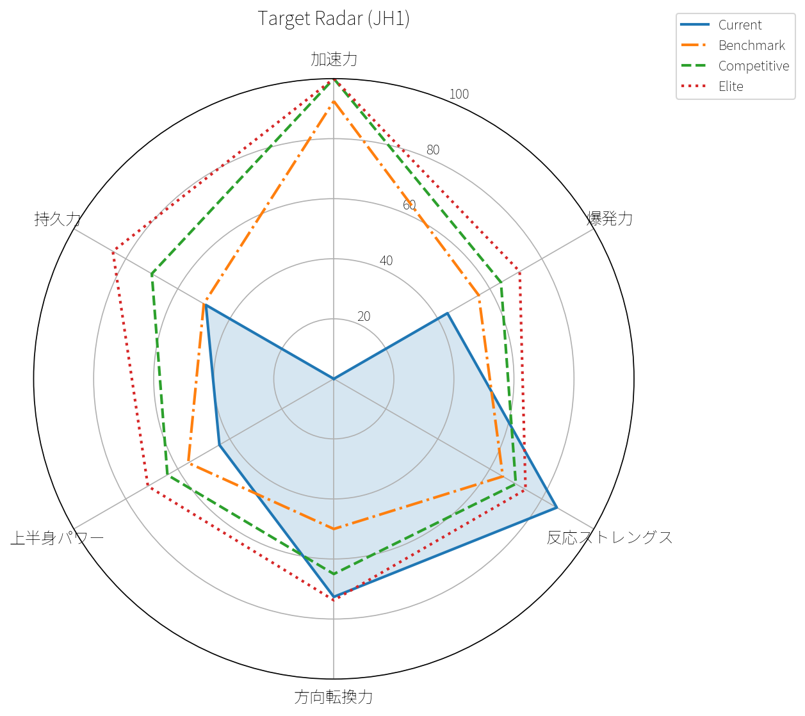

# 最新サマリー

- 最新セッション: **2026-05_test1**

## Target Gap Summary (JH1)

### Elite 目標との差

- 10m: 現在 2.44s / Elite目標 1.60s / 差 0.84s
- CMJ: 現在 25.80cm / Elite目標 36.00cm / 差 10.20cm
- RSI: 現在 2.03 / Elite目標 1.70 / 超過 0.33
- COD: 現在 6.13s / Elite目標 6.10s / 差 0.03s
- MBT 2kg: 現在 3.20m / Elite目標 4.60m / 差 1.40m
- Yo-Yo IR1: 現在 980.00m / Elite目標 2000.00m / 差 1020.00m

## 今日の優先課題

- 優先①：**加速力**
- 優先②：**上半身パワー**

## ラグビー総合フィジカルスコア

- スコア: **54.83**
- 評価帯: **基礎段階**
- 最強ドメイン: **反応ストレングス**
- 最弱ドメイン: **加速力**
- 優先課題1: **加速力**
- 優先課題2: **上半身パワー**

## 能力ドメインスコア

| 選手 | セッションID | 加速力スコア | 方向転換力スコア | 反応ストレングススコア | 爆発力スコア | 上半身パワースコア | 持久力スコア |
|---|---|---|---|---|---|---|---|
| togo | 2026-05_test1 | 18.80 | 72.63 | 85.75 | 48.09 | 44.00 | 69.97 |

## テストスコア

| 選手 | テスト | 実測値 | 単位 | スコア | 評価帯 | ドメイン | 次レベルとの差 |
|---|---|---|---|---|---|---|---|
| togo | 10m_sprint | 2.44 | s | 0.00 | 初期段階 | 加速力 | 0.79 |
| togo | 20m_sprint | 4.23 | s | 47.00 | 初期段階 | 加速力 | 0.63 |
| togo | pro_agility_5_10_5 | 6.13 | s | 72.63 | 上級 | 方向転換力 | 0.83 |
| togo | cmj | 25.80 | cm | 43.71 | 初期段階 | 爆発力 | 2.20 |
| togo | rsi | 2.03 | ratio | 85.75 | 競技レベル | 反応ストレングス | 0.57 |
| togo | standing_long_jump | 1.77 | m | 54.67 | 基礎段階 | 爆発力 | 0.23 |
| togo | medicine_ball_throw_2kg | 3.20 | m | 44.00 | 初期段階 | 上半身パワー | 0.30 |
| togo | yoyo_ir1 | 980.00 | m | 49.20 | 初期段階 | 持久力 | 20.00 |
| togo | rsa_avg_time | 4.48 | s | 85.70 | 競技レベル | 持久力 | 0.48 |
| togo | rsa_decline | 0.05 | ratio | 98.30 | エリート | 持久力 | 0.00 |

## スプリントセッション

| テスト種別 | 試技数 | best_split_5m_s | best_split_10m_s | best_split_20m_s | best_split_30m_s | best_fly_5m_s | best_fly_10m_s | best_total_time_s | 品質フラグ |
|---|---|---|---|---|---|---|---|---|---|
| sprint_30m | 3 | 1.45 | 2.44 | 4.23 | 5.97 | 0.87 | 1.75 | 5.97 | ok |

## 方向転換セッション

| テスト種別 | 左右 | 試技数 | best_segment_1_s | best_segment_2_s | best_segment_3_s | best_total_time_s | 品質フラグ |
|---|---|---|---|---|---|---|---|
| pro_agility | left | 1 | 1.21 | 3.02 | 1.97 | 6.20 | ok |
| pro_agility | right | 1 | 1.95 | 3.00 | 1.18 | 6.13 | ok |

## ジャンプセッション

| テスト種別 | 試技数 | best_jump_height_cm | avg_jump_height_cm | std_jump_height_cm | best_contact_time_ms | best_flight_time_ms | best_rsi | 品質フラグ |
|---|---|---|---|---|---|---|---|---|
| CMJ | 3 | 25.80 | 25.63 | 0.24 | - | - | - | ok |
| DJ | 3 | 17.70 | 15.17 | 2.04 | 188.00 | 380.00 | 2.03 | ok |
| SJ | 3 | 20.10 | 19.17 | 1.32 | - | - | - | ok |

## 水平ジャンプセッション

| テスト種別 | 左右 | 試技数 | best_distance_cm | avg_distance_cm | std_distance_cm | 品質フラグ |
|---|---|---|---|---|---|---|
| bounding_10 | - | 2 | 1760 | 1758.00 | 2.00 | ok |
| hop_5 | left | 2 | 710 | 699.00 | 11.00 | ok |
| hop_5 | right | 2 | 773 | 759.00 | 14.00 | ok |
| standing_long_jump | - | 3 | 177 | 171.00 | 4.90 | ok |

## 投てきセッション

| テスト種別 | 試技数 | best_distance_m | avg_distance_m | std_distance_m | 品質フラグ |
|---|---|---|---|---|---|
| medicine_ball_throw_2kg | 3 | 3.20 | 2.92 | 0.25 | ok |

## パーソナルベスト

| 選手 | テスト種別 | 指標名 | ベスト値 | 単位 | 日付 | セッションID | 左右 |
|---|---|---|---|---|---|---|---|
| togo | CMJ | best_jump_height_cm | 32.70 | cm | 2026-03-08 | 2026-03_test1 | - |
| togo | DJ | best_contact_time_ms | 130.00 | ms | 2026-04-16 | 2026-04_test1 | - |
| togo | DJ | best_flight_time_ms | 380.00 | ms | 2026-05-05 | 2026-05_test1 | - |
| togo | DJ | best_jump_height_cm | 17.70 | cm | 2026-05-05 | 2026-05_test1 | - |
| togo | DJ | best_rsi | 2.19 | - | 2026-04-16 | 2026-04_test1 | - |
| togo | SJ | best_jump_height_cm | 23.00 | cm | 2026-03-08 | 2026-03_test1 | - |
| togo | bounding_10 | best_distance_cm | 1760.00 | cm | 2026-04-16 | 2026-04_test1 | - |
| togo | hop_5 | best_distance_cm | 710.00 | cm | 2026-04-16 | 2026-04_test1 | left |
| togo | hop_5 | best_distance_cm | 773.00 | cm | 2026-04-16 | 2026-04_test1 | right |
| togo | medicine_ball_throw_2kg | best_distance_m | 3.20 | m | 2026-05-05 | 2026-05_test1 | - |
| togo | pro_agility | best_segment_1_s | 1.21 | s | 2026-05-05 | 2026-05_test1 | left |
| togo | pro_agility | best_segment_1_s | 1.95 | s | 2026-05-05 | 2026-05_test1 | right |
| togo | pro_agility | best_segment_2_s | 2.13 | s | 2026-04-16 | 2026-04_test1 | left |
| togo | pro_agility | best_segment_2_s | 2.99 | s | 2026-04-16 | 2026-04_test1 | right |
| togo | pro_agility | best_segment_3_s | 1.97 | s | 2026-05-05 | 2026-05_test1 | left |
| togo | pro_agility | best_segment_3_s | 1.18 | s | 2026-05-05 | 2026-05_test1 | right |
| togo | pro_agility | best_total_time_s | 6.08 | s | 2026-04-16 | 2026-04_test1 | left |
| togo | pro_agility | best_total_time_s | 6.13 | s | 2026-05-05 | 2026-05_test1 | right |
| togo | sprint_30m | best_fly_10m_s | 0.85 | s | 2026-04-16 | 2026-04_test1 | - |
| togo | sprint_30m | best_fly_5m_s | 0.82 | s | 2026-04-16 | 2026-04_test1 | - |
| togo | sprint_30m | best_split_10m_s | 1.62 | s | 2026-03-08 | 2026-03_test1 | - |
| togo | sprint_30m | best_split_20m_s | 3.45 | s | 2026-03-08 | 2026-03_test1 | - |
| togo | sprint_30m | best_split_30m_s | 5.39 | s | 2026-03-08 | 2026-03_test1 | - |
| togo | sprint_30m | best_split_5m_s | 1.45 | s | 2026-05-05 | 2026-05_test1 | - |
| togo | sprint_30m | best_total_time_s | 5.39 | s | 2026-03-08 | 2026-03_test1 | - |
| togo | standing_long_jump | best_distance_cm | 198.00 | cm | 2026-04-16 | 2026-04_test1 | - |
