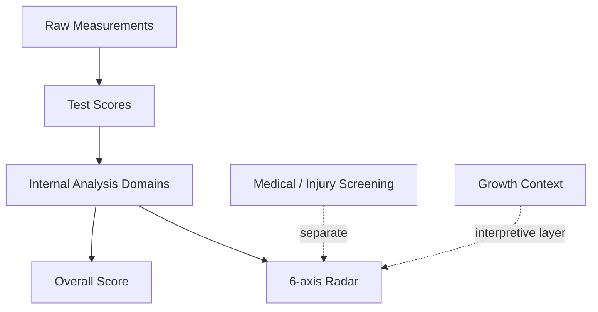
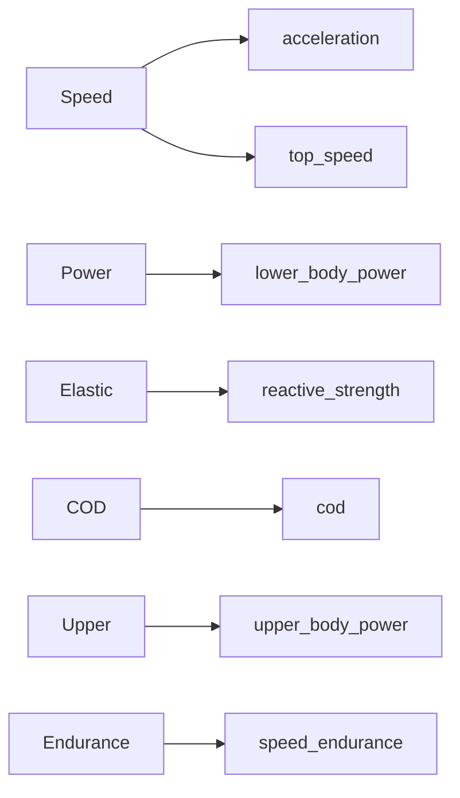
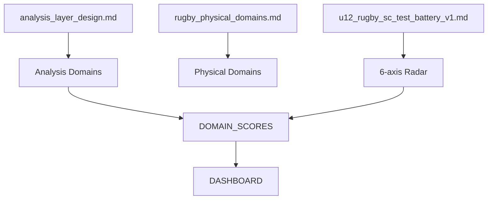

# U12ラグビーS&C分析システム 俯瞰資料 v1

---

## 1. 本資料の目的

本資料は、U12ラグビー向けフィジカル分析システムにおける

- 全体構造の整理
- レーダー設計と分析設計の関係整理
- 現状の確定事項と未解決論点の明確化

を目的とする。

---

## 2. 全体アーキテクチャ（俯瞰）

### 解釈

- Performance（スコア化対象）と
- Medical / Growth（解釈レイヤー）

は分離されている

---

## 3. レーダー設計（正本）

### 6軸（確定）

- Speed
- Power
- Elastic
- COD
- Upper
- Endurance

👉 spec（u12\_rugby\_sc\_test\_battery\_v1.md）を正本とする

---

## 4. 内部分析構造

### サブドメイン（推奨構造）

- acceleration
- top\_speed
- cod
- lower\_body\_power
- reactive\_strength
- upper\_body\_power
- speed\_endurance

👉 analysis\_layer\_design.md をベースに採用

---

## 5. レーダーと分析の関係

### 重要原則

- レーダー＝表示構造（6軸）
- サブドメイン＝分析構造（7軸）

👉 両者は一致させる必要はない

---

## 6. 測定項目との対応

| 6軸        | サブドメイン             | 主な測定                   |
| --------- | ------------------ | ---------------------- |
| Speed     | acceleration       | 5m, 10m, 20m           |
| Speed     | top\_speed         | 30m, Fly               |
| Power     | lower\_body\_power | CMJ, SJ, SLJ, Bounding |
| Elastic   | reactive\_strength | RSI, Drop Jump         |
| COD       | cod                | Pro Agility            |
| Upper     | upper\_body\_power | Medicine Ball Throw    |
| Endurance | speed\_endurance   | RSA, YoYo              |

---

## 7. データ構造（論点含む）

### 現状の候補

#### パターンA（単層）

- domain\_scores = 6軸

#### パターンB（二層）※推奨

- internal\_domain\_scores = 7サブドメイン
- domain\_scores = 6軸（レーダー用）

---

## 8. 確定事項

- 6軸レーダーは固定
- 内部は6軸より細かく持つ
- Speed / Power / Endurance は内部で分解が必要
- Elastic / COD / Upper は比較的単純

---

## 9. 未解決論点

### ① domain\_scores の構造

- 6軸で持つか
- 7サブドメインで持つか
- 二層にするか

### ② Power の分解

- vertical / horizontal を分けるか

### ③ Endurance の分解

- YoYo と RSA を分けるか

### ④ work\_capacity の扱い

- 無視するか
- 将来拡張か

---

## 10. 資料間の関係構造

### 解釈

- SPEC = 正本（何を評価するか）
- ARCH = 理論モデル（能力とは何か）
- ANALYSIS = 実装モデル（どう計算するか）

👉 domain\_scores がすべてを接続するコア

---

## 11. 今後の進め方

### 優先順位

1. domain\_scores 再設計
2. 測定→サブドメイン配分
3. profile（sprint / elastic）の役割確定
4. ドキュメント統一

---

## 12. 一言でまとめると

👉 レーダーは世界観 👉 サブドメインは分析 👉 domain\_scoresは翻訳層

---

